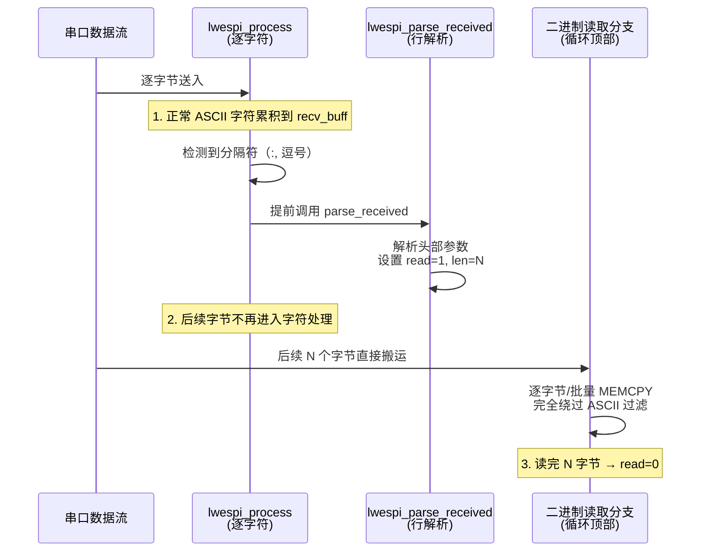

# BLE GATTCRD 数据丢弃问题深度分析

## 一、问题现象

AT 命令及返回示例：
```
AT+BLEGATTCRD=0,3,1\r\n
OK\r\n
+BLEGATTCRD:0,4,000\nCHU\r\n
```

返回格式：`+BLEGATTCRD:<conn_index>,<len>,<value>\r\n`

其中 `<len>=4`，`<value>` 是 4 字节原始数据。如果这 4 字节中恰好包含 `0x0A`（`\n`）、`0x00`（NULL）、`0x01`~`0x1F`（控制字符）等非 ASCII 可见字符，就会在 `lwespi_process` 中被丢弃或导致提前截断。

---

## 二、`lwespi_process` 数据处理架构

函数核心是一个 `while (d_len > 0)` 循环，逐字节处理串口输入。结构如下：

```c
while (d_len > 0) {
    ch = *d++; --d_len;

    // ===== 第一优先级：二进制数据直接读取（绕过全部字符检查） =====
    if (esp.m.ipd.read) {
        /* +IPD 网络数据：按 rem_len 字节数直接搬运 */
    }
    else if (CMD_IS_CUR(CIPRECVDATA) && conn_recv.read) {
        /* +CIPRECVDATA 手动TCP读取：按 tot_len 字节数直接搬运 */
    }
    else if (CMD_IS_CUR(SYSMFG_READ) && mfg_read.read_mode) {
        /* +SYSMFG 闪存数据：按 btr 字节数直接搬运 */
    }

    // ===== 第二优先级：ASCII/Unicode 逐字符处理 =====
    else {
        if (LWESP_ISVALIDASCII(ch)) {       // 32~126, \r, \n
            res = lwespOK;  → RECV_ADD(ch)
        } else if (ch >= 0x80) {
            res = unicode_decode(ch);       // 多字节 Unicode
        } else {
            res = lwespERR;                 // ← 丢弃！
        }

        if (ch == '\n') → parse_received() → 拆行处理
    }
}
```

---

## 三、数据丢弃的两道关卡

### 关卡 1：`LWESP_ISVALIDASCII` 过滤

```c
#define LWESP_ISVALIDASCII(x) (((x) >= 32 && (x) <= 126) || (x) == '\r' || (x) == '\n')
```

以下字节会被静默丢弃（`res = lwespERR`，不进入 `RECV_ADD`）：

| 字节范围 | 说明 | 示例 |
|----------|------|------|
| `0x00` | NULL | 字符串终止符 |
| `0x01`~`0x09` | 控制字符 | SOH, STX, ETX, ... TAB |
| `0x0B`~`0x0C` | 控制字符 | VT, FF |
| `0x0E`~`0x1F` | 控制字符 | SO, SI, DLE, ... US |
| `0x7F` | DEL | 删除控制符 |

> 注意：`0x0A`（`\n`）和 `0x0D`（`\r`）不会被过滤，但会触发第二道关卡。

### 关卡 2：`\n` 触发提前拆行

当 `ch == '\n'` 时，`lwespi_parse_received(&recv_buff)` 会被调用。假设数据中间出现 `\n`：

```
接收缓冲区内容: "+BLEGATTCRD:0,4,000"   ← \n 出现在此处触发解析
                                          实际完整数据: "000\nCHU"
```

结果：
- 解析器拿到的是 `+BLEGATTCRD:0,4,000`（不完整，value 只有 3 字节）
- `\n` 后面的 `CHU\r\n` 成为孤立行，无法匹配任何已知响应

---

## 四、现有的三种二进制数据处理模式

项目中已有三处面临同样问题的地方，它们都采用了同一种架构模式——**"头部文本解析 + 二进制读取模式切换"**：

### 模式 1：+IPD（自动网络数据接收）

```
+IPD,<conn>,<len>,<ip>,<port>:<binary_data>
```

| 阶段 | 位置 | 机制 |
|------|------|------|
| 触发点 | `lwespi_process` 字符处理中检测到 `ch == ':'` 且 recv_buff 匹配 `+IPD` | 行内触发 |
| 标志设置 | `lwespi_parse_ipd()` → `esp.m.ipd.read = 1`, `rem_len = len` | |
| 二进制读取 | 循环顶部 `if (esp.m.ipd.read)` 分支直接搬运字节 | 完全绕过 ASCII 检查 |
| 结束条件 | `rem_len == 0` → `read = 0` | |

### 模式 2：+CIPRECVDATA（手动 TCP 数据读取）

```
+CIPRECVDATA,<actual_len>,<ip>,<port>,<binary_data>
```

| 阶段 | 位置 | 机制 |
|------|------|------|
| 触发点 | `lwespi_process` 字符处理中检测到第 3 个逗号 + `+CIPRECVDATA` 前缀 | 逗号触发 |
| 标志设置 | `lwespi_parse_received()` → `conn_recv.read = 1`, `tot_len = len` | |
| 二进制读取 | 循环顶部 `else if (CMD_IS_CUR(CIPRECVDATA) && conn_recv.read)` 分支 | 完全绕过 ASCII 检查 |
| 结束条件 | `buff_ptr == tot_len` → `read = 0` | |

### 模式 3：+SYSMFG（闪存数据读取）

```
+SYSMFG,"namespace","key",type,length,<binary_data>
```

| 阶段 | 位置 | 机制 |
|------|------|------|
| 触发点 | `lwespi_process` 字符处理中检测到第 4 个逗号 + `+SYSMFG` 前缀 | 逗号触发 |
| 标志设置 | `lwespi_parse_received()` → `mfg_read.read_mode = 1`, `btr = length` | |
| 二进制读取 | 循环顶部 `else if (CMD_IS_CUR(SYSMFG_READ) && mfg_read.read_mode)` 分支 | 完全绕过 ASCII 检查 |
| 结束条件 | `buff_ptr == btr` → `read_mode = 0` | |

### 共同架构



---

## 五、BLEGATTCRD 应采用的方案

### 推荐方案：仿照 SYSMFG_READ 模式

`+BLEGATTCRD` 和 `+SYSMFG` 的场景最为相似：
- 都是命令响应（非 URC），有 `CMD_IS_CUR` 上下文
- 数据长度在头部参数中给出
- 数据紧跟在最后一个逗号之后
- 数据可能包含任意字节值

实现要点：

#### 1. 消息结构（`lwesp_private.h`）

在 `ble_gattc_rd` 中添加：
```c
struct {
    ...
    void* data;          /* 用户缓冲区 */
    size_t btr;          /* 用户缓冲区大小 */
    size_t* actual_len;  /* 实际读取长度输出 */
    uint8_t read_mode;   /* ← 新增：二进制读取模式标志 */
    size_t data_len;     /* ← 新增：AT 返回的数据长度 */
    size_t buff_ptr;     /* ← 新增：当前写入偏移 */
} ble_gattc_rd;
```

#### 2. 触发点（`lwespi_process` 字符处理区域，约第 1690 行）

仿照 SYSMFG_READ 的逗号检测模式，在 BLE 命令区域添加：
```c
} else if (CMD_IS_CUR(LWESP_CMD_BLEGATTCRD)) {
    /* 检测第 2 个逗号，此后进入二进制读取 */
    if (ch == ',' && RECV_LEN() > 12 && RECV_IDX(0) == '+'
        && !strncmp(recv_buff.data, "+BLEGATTCRD", 11)
        && (tmp_ptr = strchr(recv_buff.data, ',')) != NULL
        && (tmp_ptr = strchr(tmp_ptr + 1, ',')) != NULL) {
        lwespi_parse_received(&recv_buff);
        RECV_RESET();
    }
```

#### 3. 解析器设置读取模式（`lwespi_parse_received` 或 `lwespi_parse_ble_gattc_read`）

在解析函数中，解析完 `conn_index` 和 `len` 后设置读取模式：
```c
msg->msg.ble_gattc_rd.data_len = len;
msg->msg.ble_gattc_rd.read_mode = 1;
msg->msg.ble_gattc_rd.buff_ptr = 0;
```

#### 4. 二进制读取分支（`lwespi_process` 循环顶部，SYSMFG_READ 分支之后）

```c
#if LWESP_CFG_BLE
} else if (CMD_IS_CUR(LWESP_CMD_BLEGATTCRD) && esp.msg->msg.ble_gattc_rd.read_mode) {
    size_t len;

    /* 写入用户缓冲区 */
    if (esp.msg->msg.ble_gattc_rd.data != NULL
        && esp.msg->msg.ble_gattc_rd.buff_ptr < esp.msg->msg.ble_gattc_rd.btr) {
        ((uint8_t*)esp.msg->msg.ble_gattc_rd.data)[esp.msg->msg.ble_gattc_rd.buff_ptr] = ch;
    }
    ++esp.msg->msg.ble_gattc_rd.buff_ptr;

    /* 批量读取优化 */
    len = LWESP_MIN(d_len, esp.msg->msg.ble_gattc_rd.data_len - esp.msg->msg.ble_gattc_rd.buff_ptr);
    if (len > 0) {
        if (esp.msg->msg.ble_gattc_rd.data != NULL) {
            size_t copy_len = LWESP_MIN(len,
                esp.msg->msg.ble_gattc_rd.btr - esp.msg->msg.ble_gattc_rd.buff_ptr);
            if (copy_len > 0) {
                LWESP_MEMCPY(&((uint8_t*)esp.msg->msg.ble_gattc_rd.data)[esp.msg->msg.ble_gattc_rd.buff_ptr],
                             d, copy_len);
            }
        }
        d_len -= len;
        d += len;
        esp.msg->msg.ble_gattc_rd.buff_ptr += len;
    }

    /* 读取完成 */
    if (esp.msg->msg.ble_gattc_rd.buff_ptr == esp.msg->msg.ble_gattc_rd.data_len) {
        esp.msg->msg.ble_gattc_rd.read_mode = 0;
        if (esp.msg->msg.ble_gattc_rd.actual_len != NULL) {
            *esp.msg->msg.ble_gattc_rd.actual_len =
                LWESP_MIN(esp.msg->msg.ble_gattc_rd.data_len, esp.msg->msg.ble_gattc_rd.btr);
        }
        /* 触发事件回调 */
        esp.evt.evt.ble_gattc_read.conn_index = esp.msg->msg.ble_gattc_rd.conn_index;
        esp.evt.evt.ble_gattc_read.len = esp.msg->msg.ble_gattc_rd.data_len;
        esp.evt.evt.ble_gattc_read.data = (const uint8_t*)esp.msg->msg.ble_gattc_rd.data;
        lwespi_send_cb(LWESP_EVT_BLE_GATTC_READ);
    }
#endif /* LWESP_CFG_BLE */
```

---

## 六、方案对比

| 维度 | 方案 A：ASCII 放行 + `\n` 拦截<br/>（前次修改） | 方案 B：read_mode 二进制模式<br/>（推荐） |
|------|--------------------------------------------------|------------------------------------------|
| **完整性** | ❌ 只修了 `\n`，`0x00`~`0x1F` 的其他字节仍被丢弃 | ✅ 所有字节无损读取 |
| **性能** | ❌ 每字节都经过 ASCII 检查 + 字符串匹配 | ✅ 二进制模式下批量 MEMCPY |
| **一致性** | ❌ 引入了全新的处理方式 | ✅ 完全复用 IPD/CIPRECVDATA/SYSMFG 的成熟模式 |
| **可维护性** | ❌ `\n` 拦截逻辑复杂，需要动态计算期望长度 | ✅ 结构清晰，一目了然 |
| **`0x00` 处理** | ❌ `0x00` 进入 recv_buff 后会截断字符串函数 | ✅ 绕过 recv_buff，直接写入用户缓冲区 |
| **引用号处理** | ❌ 引号混在 recv_buff 中需要特殊处理 | ✅ 可在触发时确定是否跳过引号 |

> [!IMPORTANT]
> 方案 A（前次修改）存在严重缺陷：即使 `\n` 问题被拦截，`0x00` 字节仍会进入 `recv_buff`（一个 `char[]` 缓冲区）。所有后续的 `strncmp`、`strchr` 等字符串操作都会在遇到 `0x00` 时提前终止，导致解析失败。这是方案 A 无法修补的根本性问题。

---

## 七、需要确认的问题

> [!WARNING]
> **AT 返回的 `<value>` 是原始二进制还是十六进制字符串？**
> 
> - 如果 `<value>` 是**原始二进制**（如 `0x30 0x30 0x30 0x0A`），则必须使用 read_mode 方案
> - 如果 `<value>` 是**十六进制 ASCII 字符串**（如 `"3030300A"`），则所有字符都在可见 ASCII 范围内，理论上不会被丢弃——但仍建议使用 read_mode 以保持架构一致性
>
> 请确认您实际测试时 ESP 返回的数据格式，这将影响触发点的判定逻辑（是否需要处理引号）。

---

## 九、最终解决方案：URC 模式 + 全局状态持久化 (方案 C)

### 1. 发现新问题：OK 先于数据到达
在实测中发现，ESP-AT 对于 `AT+BLEGATTCRD` 的响应顺序是：
```
OK\r\n
+BLEGATTCRD:0,4,\xDE\xAD\xBE\xEF\r\n
```
这导致了一个致命时序问题：
1. `OK` 到达，LwESP 认为命令已完成，调用 `lwespi_process_sub_cmd` 并释放信号量。
2. `esp.msg` 被设置为 `NULL` 或被回收。
3. `+BLEGATTCRD` 数据随后到达，但此时 `CMD_IS_CUR(LWESP_CMD_BLEGATTCRD)` 已为 `false`。
4. 原有的 `read_mode` 逻辑（存储在 `esp.msg` 中）和触发逻辑全部失效。

### 2. 解决方案：重构为 URC 处理架构
将 `+BLEGATTCRD` 的数据接收重构为 URC 模式，使其不依赖于 `esp.msg` 的生命周期。

#### A. 状态持久化 (`lwesp_private.h`)
在全局结构体 `esp.m.ble` 中新增 `gattc_rd` 成员，用于持久化存储二进制读取的运行时状态（类似 `esp.m.ipd` 的设计）。

#### B. 预拷贝缓冲区信息 (`lwesp_int.c`)
在 `lwespi_initiate_cmd` 发送 AT 命令之前，将用户缓冲区指针 (`data`)、预期长度 (`btr`) 等信息从 `msg` 拷贝到全局 `esp.m.ble.gattc_rd` 中。

#### C. 剥离 `CMD_IS_CUR` 依赖
- **解析器匹配**：在 `lwespi_parse_received` 中移除 `CMD_IS_CUR` 检查，使 `+BLEGATTCRD:` 能够被独立解析。
- **二进制模式触发**：在 `lwespi_process` 的逗号触发检测中移除 `CMD_IS_CUR` 检查。
- **数据搬运**：二进制读取分支直接使用全局状态 `esp.m.ble.gattc_rd.read_mode`。

### 3. 修复后的数据流
1. 用户调用 API，信息存入 `esp.msg`。
2. 命令发送，关键信息同步到全局状态。
3. `OK` 到达，命令正常释放，信号量解除阻塞。
4. 随后 `+BLEGATTCRD` URC 到达，解析器根据全局状态开启 `read_mode`。
5. 二进制字节流绕过 ASCII 过滤，准确存入用户缓冲区。
6. 读取完成后触发 `LWESP_EVT_BLE_GATTC_READ` 事件通知应用层。

---
**结论**：该方案彻底解决了 `OK` 时序导致的丢包问题，并提供了最高性能和最可靠的二进制数据保护机制。

